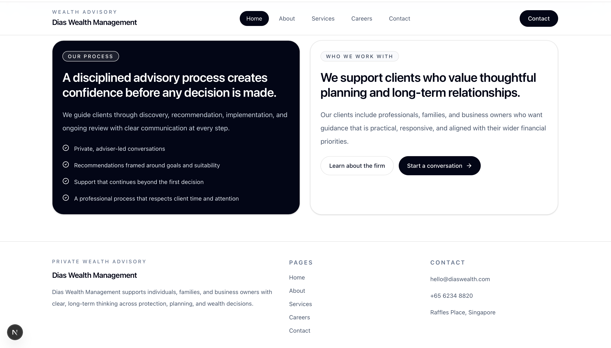
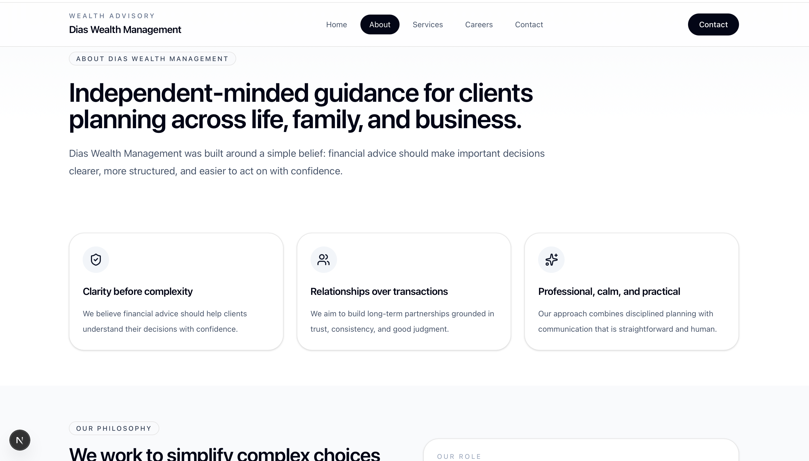
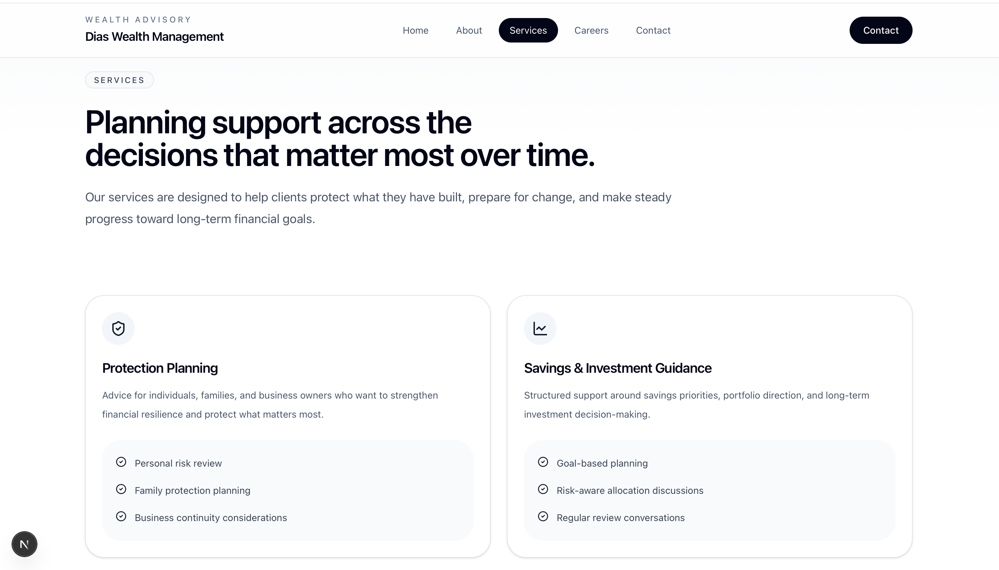
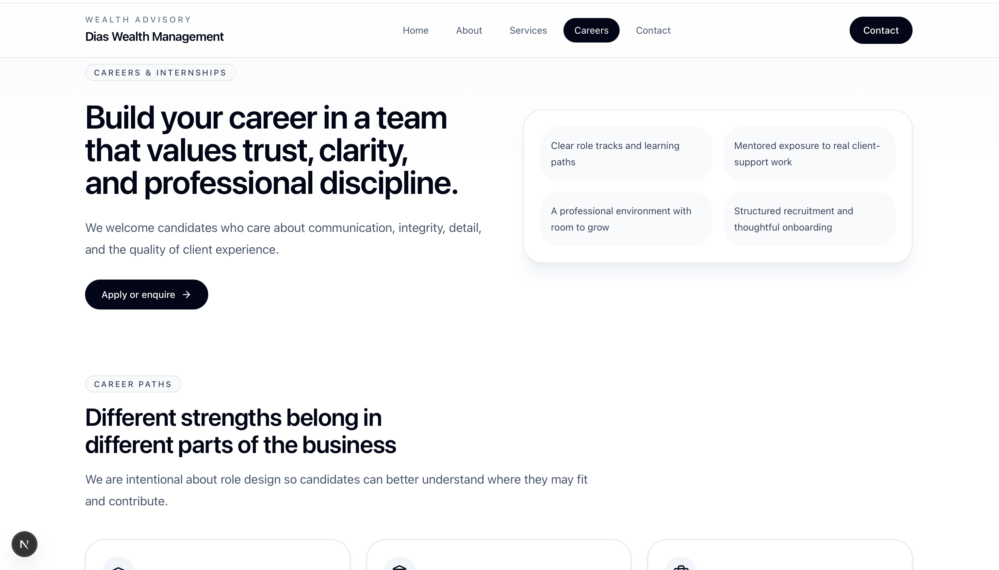

# Dias Wealth Management

A modern multi-page corporate website for a wealth management firm, built with Next.js, TypeScript, and Tailwind CSS.

This project was created to showcase a polished financial-services brand presence with a strong focus on trust, clarity, responsive design, and production-ready frontend architecture.

link: https://website-dias-wealth-management.vercel.app

---

## Overview

Dias Wealth Management is a professional corporate website designed for a financial advisory brand. The site presents the company's services, positioning, career opportunities, and contact experience through a clean and structured interface.

The goal of the project was to build a website that feels credible, premium, and easy to navigate while reflecting the expectations of a modern financial-services audience.

---

## Key Highlights

- Built a fully responsive multi-page website from scratch
- Designed a clean, trust-focused interface for a financial-services brand
- Structured the project using Next.js App Router
- Developed reusable UI components for consistent design and scalability
- Added page-level metadata for stronger SEO foundations
- Implemented a server-side contact form workflow with validation
- Focused on readability, hierarchy, and professional brand presentation

---

## Pages Included

- Home
- About
- Services
- Careers
- Contact

---

## Screenshots
### Home

### About

### Services

### Contact

---

## Tech Stack

- Next.js
- React
- TypeScript
- Tailwind CSS
- shadcn/ui
- Framer Motion

---

## Features

- Multi-page App Router architecture
- Responsive layouts for desktop and mobile
- Reusable component-based UI structure
- Professional corporate design system
- SEO-ready metadata setup
- Server-side contact form handling
- Clean navigation and content hierarchy

---

## Project Structure

app/                  # Routes, pages, metadata, API routes
components/           # Reusable UI and layout components
lib/                  # Shared helpers and utilities
public/               # Static assets
docs/screenshots/     # README screenshots

---

## Getting Started

### 1. Clone the repository

git clone https://github.com/ictdissa/website_dias_wealth_management.git
cd your-repo

### 2. Install dependencies

npm install

### 3. Create a local environment file

Create a `.env.local` file in the root of the project and add:

NEXT_PUBLIC_SITE_URL=http://localhost:3000
CONTACT_WEBHOOK_URL=

### 4. Run the development server

npm run dev

Open http://localhost:3000 in your browser.

---

## Production Build

To test the production version locally:

npm run build
npm run start

---

## Available Scripts

npm run dev
npm run build
npm run start
npm run lint

---

## Design Approach

The website was designed to communicate professionalism and credibility through a restrained visual style, clear typography, consistent spacing, and structured content sections.

Special attention was given to:

- creating a premium yet accessible visual identity
- improving information hierarchy across all pages
- making the interface readable and trustworthy
- ensuring consistency across desktop and mobile layouts
- building a scalable frontend structure suitable for future expansion

---

## Deployment

This project can be deployed on platforms that support Next.js, including:

- Vercel
- Netlify
- Docker
- Node.js VPS hosting

---

## Notes

- Do not commit `.env.local`
- Replace placeholder repository and domain links before publishing
- Add final screenshots before pushing to GitHub for the best presentation

---

## License

This project is presented for portfolio and educational purposes.
